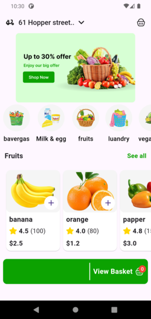
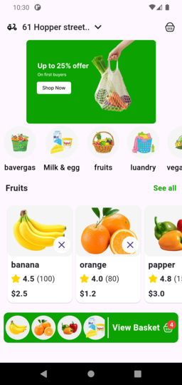
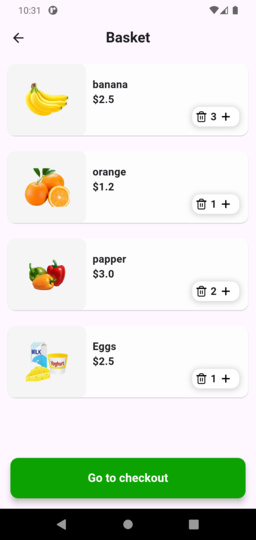

# 🍓 Fruits App

A simple Flutter application to browse and manage a basket of fruits, with a modern UI and support for multiple platforms (Android, iOS, Windows, Linux, Web).

## 📱 Features

- Browse a list of fruit products with images, prices, and ratings
- Add or remove products from your basket
- Adjust quantities in the basket
- View basket contents and proceed to checkout
- Responsive design for mobile and desktop

## 🛠️ Technologies Used

- [Flutter](https://flutter.dev/) (Dart)
- Platform support: Android, iOS, Windows, Linux, Web
- Local asset images for products and UI icons

## Screenshots






## 📁 Project Structure

```
lib/
├── main.dart                # App entry point
├── colors.dart              # App color definitions
├── models/
│   ├── category.dart        # Category model
│   └── product.dart         # Product model
├── screens/
│   ├── home.dart            # Home screen with product list
│   ├── Basket.dart          # Basket screen
│   └── splash.dart          # Splash screen
├── widgets/
│   └── productCard.dart     # Product card widget
assets/
└── ...                      # Images and icons
```

## 🚀 Getting Started

1. **Clone the repository:**

   ```sh
   git clone https://github.com/yourusername/fruits_app.git
   cd fruits_app
   ```

2. **Install dependencies:**

   ```sh
   flutter pub get
   ```

3. **Run the app:**
   ```sh
   flutter run
   ```

## 🧪 Running Tests

Run widget tests with:

```sh
flutter test
```

## 📦 Building for Desktop

- **Windows:**
  ```sh
  flutter build windows
  ```
- **Linux:**
  ```sh
  flutter build linux
  ```

## 📄 License

This project is licensed under the MIT License.

---

Made with ❤️
